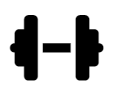
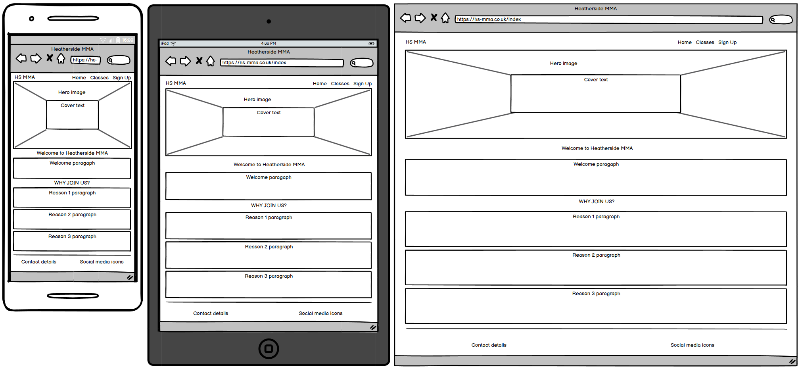
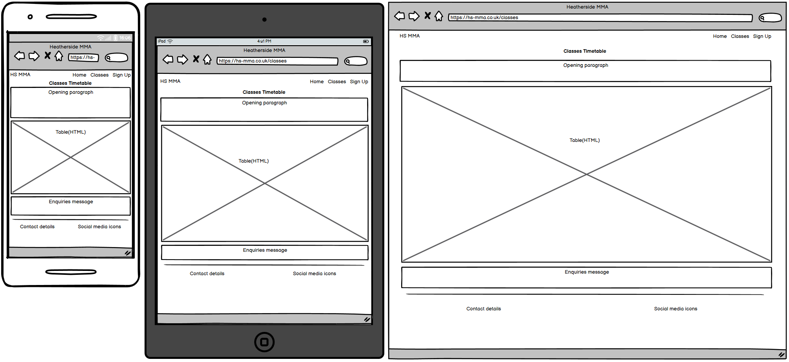
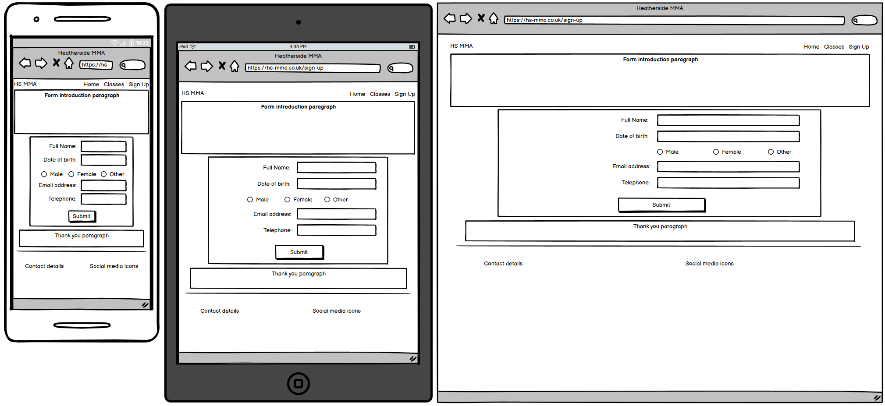
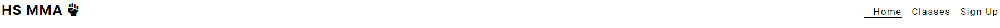
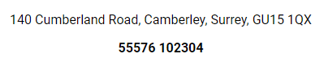
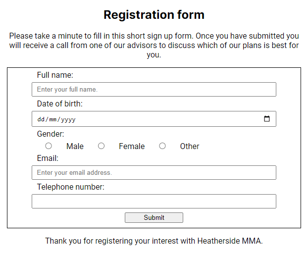

# HS MMA

HS MMA is a website for a martial arts gym based in Heatherside, England. The sites target audience is anyone interested in martial arts and self defence. HS MMA will be useful because it will inform visitors of the services provided, available classes and necessary contact information.

## User Experience

### Design

#### Typography

On the site I decided to use two different fonts from Google Fonts. These are Roboto and Inter. I chose to use these fonts because they were both identified as popular fonts at the time of design. They were similar enough to look visually appealing whilst providing a slight distinction between paragraphs and headings.

#### Icons

I have used multiple Icons from Font Awesome to complete this project.

##### Fist

This icon was chosen as it fits the companies theme of hand to hand combat and it conveys strength, resilience and determination.

##### Dumbbell

This icon was chosen for the get fit section because it was a good visual aid to go along with the message. This is because it symbolises fitness and working out.

##### Comments

This icon was chosen for the stay social section because it was a good visual aid to go along with the message. This is because it implies two people talking and socialising.

##### User shield

This icon was chosen for the gain confidence section because it was a good visual aid to go along with the message. This is because it shows the user being safe or protected, which fits well with the theme of protecting yourself and others.

##### Facebook

This icon was chosen for the link as it is immediately clear to the user what it is for. The square variant was chosen to be consistent across the 4 social media links.

##### X

This icon was chosen for the link as it is immediately clear to the user what it is for. The square variant was chosen to be consistent across the 4 social media links.

##### Instagram

This icon was chosen for the link as it is immediately clear to the user what it is for. The square variant was chosen to be consistent across the 4 social media links.

##### Youtube

This icon was chosen for the link as it is immediately clear to the user what it is for. The square variant was chosen to be consistent across the 4 social media links.

#### Wireframes

##### Index

##### Classes

##### Sign Up

### User Stories

#### First Time Visitor Goals

- To look for inspiration in joining a MMA gym, that reassures and welcomes newcomers to the sport.
- To quickly find out what classes are available, so I can check my favourite martial arts are included.
- To find contact information for the gym, so I can make enquiries.
- To easily sign up for a membership, without too many fields or unnecessary questions.

#### Returning Visitor Goals

- To look at class times, so that I don't miss a session or can train in another martial art.
- To keep up to date with any changes or additions to classes, so I can make the most of my membership.

## Features

### Existing Features

#### Navbar

This is the navbar which can be found at the top of all 3 of the sites pages. The logo can be found on the left, which when clicked will also act as a link to return to the home page. The links to the other pages can be found on the right. The current page will always be underlined and when the user hovers over another of the links it will be underlined also.

#### Why Join Section

  
This is the why join section found on the home page. The purpose of this section is to re-assure and inspire the new users with less experience to sign up and get involved with the gym.

#### Contact Details

  
This is the contact details section which can be found on the left side of the footer of all 3 pages. This ensures that regardless of what page the user is on they will be able to locate the required information, whether they need to find the address or make contact with enquiries.

#### Social Links

  
This is the social links section which can be found on the right side of the footer of all 3 pages. This enables the users to obtain more information from social media if that is their preferred method. Links will open in a new window.

#### Classes Timetable 

This is the classes timetable found on the classes page. It's purpose is to showcase the variety of classes available at the gym and act as a reminder for those who attend so they don't miss a session.

#### Sign Up Form

  
This is the sign up form found on the sign up page. This allows new users to enter their personal information so they can enrol with the gym. For now it is limited to requesting a chat with an advisor at the gym, so the staff and visitor can work on creating their bespoke membership plan.

### Features Left to Implement

#### Gallery

A possible feature would be a gallery page which could effectively showcase the location and classes that the gym has to offer. This could reduce any fears or doubts felt by new users and possibly encourage them to take part and sign up.

#### Dynamic Classes Timetable

In the future it would be much more efficient if the classes timetable was directly linked to a database, this would allow for real-time changes to the timetable without having to manually adjust the tables contents.

#### Sign In Feature

Another interesting feature would be to allow users to create accounts and sign in upon visiting the site. This would have a lot of benefits; such as being able to link your account to the specific classes you attend so you can receive relevant updates, connect with other users, enhance visibility of classes already enrolled in and much more.

## Testing

Testing documentation can be found separately here: [TESTING.md](TESTING.md).

## Technologies

### Languages

HTML, CSS, JavaScript

### Libraries & Programs Used

- Balsamiq - Used to create wireframes.
- Git - Used for version control.
- Github - Used to save site files.
- Google Fonts - Used to import fonts.
- Font Awesome - Used to import icons.
- Chrome Developer Tools - Used to test site responsiveness and design features.
- PageSpeed - Used to lighthouse test the site.

## Deployment

This site was developed using [codeanywhere](https://codeanywhere.com/) and [GitPod](https://www.gitpod.io/), then committed to git and pushed to [GitHub](https://github.com/).

This site is deployed using GitPages. The following steps must be taken:  
1 - Locate the github repository on GitHub. [Here](https://github.com/JCook22/hs-mma)
2 - Find settings from the options at the top of the screen.
3 - Navigate down to the Pages section.
4 - From the source drop-down box select Deploy from a branch.

## Credits

### Content

To center the cover text I learnt from this tutorial on W3Schools. (https://www.w3schools.com/howto/howto_css_image_text.asp)

### Media

For the hero image I used Shutterstock. (https://www.shutterstock.com/image-photo/noname-image-kickboxer-on-dark-background-2146195251)
