# HS MMA - Testing

## Validator Testing 

I used the W3C validator to check the HTML and CSS for the site. All tests passed with no issues.

### HTML

index.html

classes.html
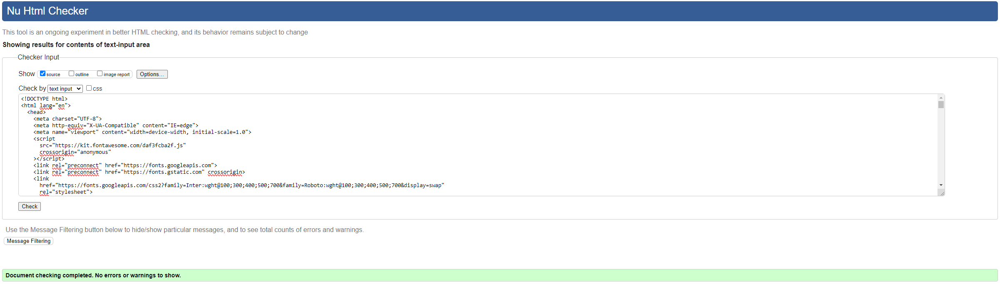

sign-up.html
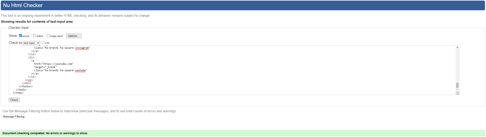

### CSS

style.css
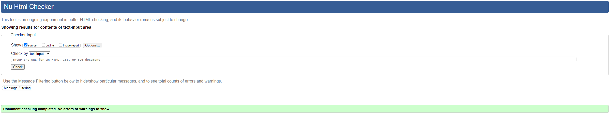

## Lighthouse Testing

### Mobile

index.html  
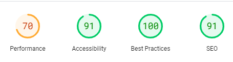

classes.html  
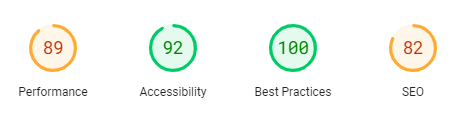

signup.html  
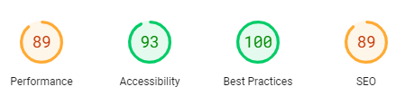

### Desktop

index.html  
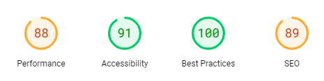

classes.html  
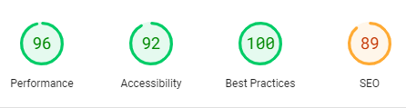

signup.html  
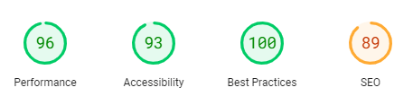

## Manual Testing 

### User Stories

#### First Time Visitor Goals

- To look for inspiration in joining a MMA gym, that reassures and welcomes newcomers to the sport.  
  - This is achieved with the why-join section on the index page, which details a few of many benefits of joining the gym.
  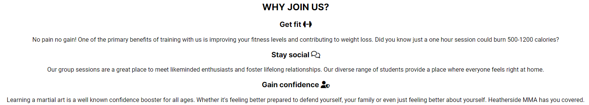
- To quickly find out what classes are available, so I can check my favourite martial arts are included.
  - This is achieved with the classes timetable, easily located using the navbar. It details all classes offered and the times.
  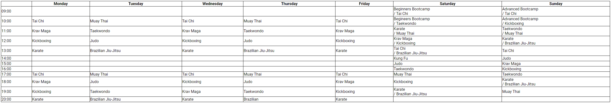
- To find contact information for the gym, so I can make enquiries.
  - This is achieved with the contact details section of the footer, to ensure it's always easy to find.
  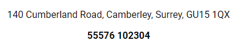
- To easily sign up for a membership, without too many fields or unnecessary questions.
  - This is achieved with the sign up form, which was intentionally kept simple for the user. They answer a few basic questions and the staff will contact them to finish the process and create a bespoke plan.
  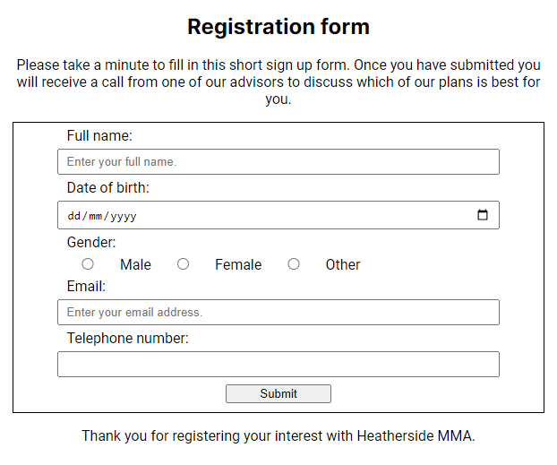

#### Returning Visitor Goals

- To look at class times, so that I don't miss a session or can train in another martial art.
  - This is achieved with the classes timetable, it ensures it is simple to check when class is scheduled and shows the user all other available options.
  
- To keep up to date with any changes or additions to classes, so I can make the most of my membership.
  - This is also achieved with the classes timetable, it will be updated as changes are made so that members always know the latest options available to them.
  

### Feature Testing

#### Site-wide features

##### Logo

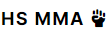
- Expected - Should take the user back to the index page if the user clicks on it.
- Testing - Will click on the logo on the classes page to go to the index page.
- Result - The site behaved as expected and I was taken to the index page.

##### Link hover effect

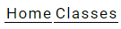
- Expected - The Navbar links should be underlined when the user hovers over them.
- Testing - Will hover over the classes page whilst on the index page.
- Result - The site behaved as expected and the Classes page was underlined when hovered over.

##### Navbar home link

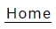
- Expected - Should take the user to the index page if the user clicks on it.
- Testing - Will click on the index link on the sign up page.
- Result - The site behaved as expected and I was taken to the index page.

##### Navbar classes link

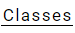
- Expected - Should take the user to the classes page if the user clicks on it.
- Testing - Will click on the classes link on the index page.
- Result - The site behaved as expected and I was taken to the classes page.

##### Navbar sign up link

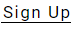
- Expected - Should take the user to the sign up page if the user clicks on it.
- Testing - Will click on the sign up link on the index page.
- Result - The site behaved as expected and I was taken to the sign up page.

##### Footer facebook link

- Expected - Should open facebook.com in a new tab if the user clicks on it.
- Testing - Will click on the facebook link.
- Result - The site behaved as expected and facebook.com opened in a new tab.

##### Footer X link

- Expected - Should open twitter.com in a new tab if the user clicks on it.
- Testing - Will click on the x link.
- Result - The site behaved as expected and twitter.com opened in a new tab.

##### Footer instagram link

- Expected - Should open instagram.com in a new tab if the user clicks on it.
- Testing - Will click on the instagram link.
- Result - The site behaved as expected and instagram.com opened in a new tab.

##### Footer youtube link

- Expected - Should open youtube.com in a new tab if the user clicks on it.
- Testing - Will click on the youtube link.
- Result - The site behaved as expected and youtube.com opened in a new tab.

#### Specific features

##### Form input fields

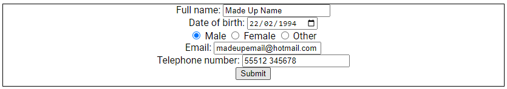
- Expected - Should not allow the user to input incorrect data types to the input areas and only welcome the correct data types.
- Testing - Will fill in the form with fake user details to see if it accepts the data.
- Result - The site behaved as expected and allowed the user to complete the fields and submit the form.

##### Form submission

- Expected - Should tell the user they have submitted the form correctly when the user has filled in their details and clicked submit.
- Testing - Will use a fake example of a user to complete the form.
- Result - The site behaved as expected and congratulated the user for submitting the form correctly.
